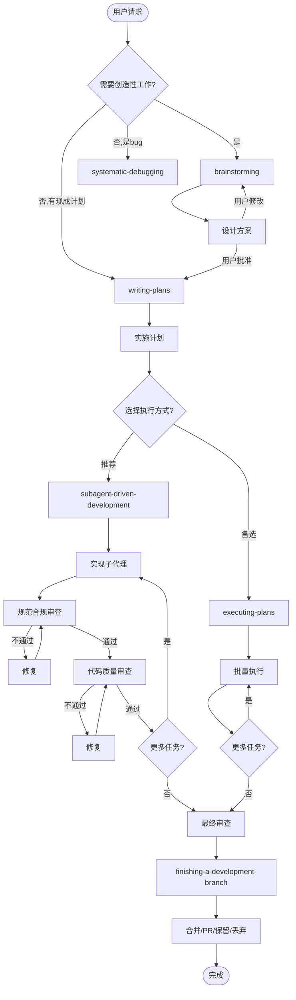

# Skill 组合与工作流编排分析

> 分析来源：superpowers 项目 + spark-skills 生态
> 分析日期：2026-04-10

## 一、Superpowers 工作流全景

Superpowers 定义了一套严格的开发工作流，从想法到交付的完整链路：

```
用户请求 → brainstorming → writing-plans → subagent-driven-development / executing-plans → finishing-a-development-branch
```

### 核心工作流图



## 二、各 Skill 详细分析

### 2.1 using-superpowers（入口 Skill）

**定位**：所有对话的前置技能，确保 AI 知道如何使用技能系统。

**核心规则**：
- 即使只有 1% 的可能适用，也必须调用技能
- 优先级：用户指令 > superpowers 技能 > 系统默认
- 流程技能（brainstorming、debugging）优先于实现技能

**触发方式**：SessionStart Hook 自动注入（见 hooks 分析文档）

**关键红牌规则**：

| 思维 | 现实 |
|------|------|
| "这太简单了不需要设计" | 简单项目更容易忽略假设 |
| "我先看看代码" | 技能告诉你如何看代码 |
| "我记得这个技能" | 技能会演进，读当前版本 |
| "这个技能太重了" | 简单的事变复杂是常态 |

### 2.2 brainstorming（头脑风暴）

**定位**：所有创造性工作的前置技能。

**硬性门控**：设计未获批准前，禁止调用任何实现技能、写任何代码。

**流程**：
1. 探索项目上下文（文件、文档、提交历史）
2. 如涉及视觉问题 → 提供可视化伴侣
3. 逐个提问澄清需求（一次一个问题）
4. 提出 2-3 种方案 + 权衡 + 推荐
5. 分段展示设计，每段获取用户批准
6. 写设计文档 → `docs/superpowers/specs/YYYY-MM-DD-<topic>-design.md`
7. 自检（占位符、矛盾、范围、歧义）
8. 用户审查设计文档
9. **唯一出口**：调用 writing-plans

**设计原则**：
- YAGNI（你不需要它）— 无情删减不必要功能
- 设计隔离和清晰 — 每个单元一个明确目的
- 在现有代码库中遵循既有模式

### 2.3 writing-plans（编写计划）

**定位**：将设计文档转化为可执行的实施计划。

**核心原则**：
- 假设执行者对代码库零了解
- 每步一个动作（2-5 分钟）
- TDD 循环：写失败测试 → 实现 → 重构
- 无占位符：每步包含完整代码和命令

**计划文档结构**：
```
# [Feature Name] Implementation Plan
> For agentic workers: REQUIRED SUB-SKILL: ...

**Goal:** ...
**Architecture:** ...
**Tech Stack:** ...

### Task N: [Component Name]
**Files:** Create/Modify/Test
- [ ] Step 1: 写失败测试 [含完整代码]
- [ ] Step 2: 运行验证失败
- [ ] Step 3: 最小实现 [含完整代码]
- [ ] Step 4: 运行验证通过
- [ ] Step 5: 提交
```

**自检清单**：
1. 规范覆盖：每个需求都有对应任务？
2. 占位符扫描：无 TBD/TODO/模糊描述
3. 类型一致性：前后任务的类型/函数名一致

**出口**：提供两个执行选项
- Subagent-Driven（推荐）→ 调用 subagent-driven-development
- Inline Execution → 调用 executing-plans

### 2.4 subagent-driven-development（子代理驱动开发）

**定位**：逐任务分派子代理执行，双阶段审查。

**核心流程（每个任务）**：
1. 分派实现子代理（提供完整任务文本 + 上下文）
2. 子代理状态处理：
   - DONE → 进入审查
   - DONE_WITH_CONCERNS → 评估后进入审查
   - NEEDS_CONTEXT → 补充上下文后重新分派
   - BLOCKED → 评估阻塞原因
3. 规范合规审查（spec reviewer 子代理）
4. 代码质量审查（code quality reviewer 子代理）
5. 标记任务完成

**模型选择策略**：
- 机械任务（1-2 个文件）→ 快速廉价模型
- 集成任务（多文件协调）→ 标准模型
- 架构/设计/审查 → 最强模型

**vs executing-plans**：
- 同一会话内执行（无上下文切换）
- 每个任务独立子代理（无上下文污染）
- 自动审查检查点

### 2.5 executing-plans（内联执行）

**定位**：在同一会话中顺序执行计划，适合无子代理支持的平台。

**流程**：加载计划 → 批量执行 → 检查点审查 → 继续或停止

### 2.6 finishing-a-development-branch（完成分支）

**定位**：实现完成后的收尾技能。

**流程**：
1. 验证测试通过
2. 确定 base 分支
3. 提供 4 个选项：
   - 合并到 base 分支
   - 推送并创建 PR
   - 保留分支
   - 丢弃工作
4. 执行选择 + 清理 worktree

### 2.7 其他辅助技能

| 技能 | 定位 |
|------|------|
| systematic-debugging | 系统化调试流程 |
| test-driven-development | TDD 红-绿-重构循环 |
| using-git-worktrees | Git worktree 隔离工作区 |
| verification-before-completion | 完成前验证 |
| requesting-code-review | 请求代码审查 |
| receiving-code-review | 接收代码审查 |
| dispatching-parallel-agents | 并行代理调度 |
| writing-skills | 编写新技能的技能 |

## 三、Skill 组合模式分析

### 模式 1：标准开发流程（最常用）

```
using-superpowers (自动注入)
    → brainstorming (设计)
        → writing-plans (计划)
            → subagent-driven-development (实现+审查)
                → finishing-a-development-branch (收尾)
```

这是 Superpowers 推荐的完整开发链路。

### 模式 2：快速修复流程

```
using-superpowers (自动注入)
    → systematic-debugging (定位问题)
        → executing-plans (快速修复)
            → finishing-a-development-branch (收尾)
```

不需要完整设计流程的 bug 修复。

### 模式 3：探索/分析流程

```
using-superpowers (自动注入)
    → brainstorming (理解问题)
        → [只做设计，不实现]
```

仅需设计方案，暂不实现。

### 模式 4：计划执行流程

```
writing-plans (已有计划)
    → subagent-driven-development
        → finishing-a-development-branch
```

跳过设计阶段，直接从计划开始执行。

## 四、与 spark-skills 生态的集成

### 已有 Skill 如何与 Superpowers 协作

| spark-skills Skill | 在 Superpowers 工作流中的位置 |
|--------------------|-----------------------------|
| `github-task-workflow` | 替代 finishing-a-development-branch 的 PR 创建 |
| `innate-frontend` | 作为 domain skill 在 brainstorming 中引用 |
| `tauri-desktop-app` | 作为 domain skill 在 brainstorming 中引用 |
| `ai-config` | 独立使用，不参与开发流程 |
| `local-workflow` | 替代 github-task-workflow 用于本地追踪 |

### 组合架构

```
Superpowers (开发流程框架)
    ├── 流程 Skills (内置)
    │   ├── brainstorming
    │   ├── writing-plans
    │   ├── subagent-driven-development
    │   └── finishing-a-development-branch
    │
    ├── 领域 Skills (spark-skills 提供)
    │   ├── innate-frontend (前端开发)
    │   ├── tauri-desktop-app (桌面应用)
    │   └── [未来: go-cli-skill, data-viz-skill, ...]
    │
    └── 工具 Skills (spark-skills 提供)
        ├── github-task-workflow (任务管理)
        ├── ai-config (AI 配置)
        └── spark-task-init (任务初始化)
```

## 五、工作流编排建议

### 建议方案：三层架构

**第一层 — SessionStart Hook（自动注入）**

在 `.claude/settings.json` 或 `hooks/hooks.json` 中配置：

```json
{
  "hooks": {
    "SessionStart": [
      {
        "matcher": "startup",
        "hooks": [
          {
            "type": "command",
            "command": "path/to/hooks/load-skills-context.sh",
            "async": false
          }
        ]
      }
    ]
  }
}
```

注入内容：
- superpowers 的 `using-superpowers` 规则
- 项目特定的领域 Skill 摘要（如 innate-frontend 组件规范）

**第二层 — 开发流程 Skill（Superpowers）**

保持 Superpowers 的标准流程不变：
```
brainstorming → writing-plans → subagent-driven-development → finishing
```

在 brainstorming 阶段，根据项目类型自动引入领域 Skill：
- 前端项目 → `innate-frontend`
- 桌面应用 → `tauri-desktop-app`
- CLI 工具 → `go-cli-skill`（待创建）

**第三层 — 任务管理 Skill（spark-skills）**

将 `github-task-workflow` 或 `local-workflow` 集成到工作流中：

**方案 A：替代 finishing**
```
... → subagent-driven-development → github-task-workflow (创建 Issue + PR)
```

**方案 B：全程集成**
```
github-task-workflow init → brainstorming → ... → github-task-workflow finish
```

### 推荐配置

#### 1. 安装 Superpowers + 自定义 Skills

```bash
# 安装 superpowers
cd spark-skills/superpowers
./install.sh claude-code

# 安装领域 Skills
cd spark-skills/innate-frontend
# 链接到 Claude Code skills 目录
ln -s $(pwd) ~/.claude/skills/innate-frontend
ln -s $(pwd)/../tauri-desktop-app ~/.claude/skills/tauri-desktop-app
```

#### 2. 配置 Hooks

在 `.claude/settings.json` 中：

```json
{
  "hooks": {
    "SessionStart": [
      {
        "matcher": "startup",
        "hooks": [
          {
            "type": "command",
            "command": "echo '{\"hookSpecificOutput\":{\"hookEventName\":\"SessionStart\",\"additionalContext\":\"项目使用 @innate/ui 组件库（57 基础组件+13 业务区块）。前端统一 Next.js 16 + Tailwind CSS v4 + OKLCH 主题。详见 innate-frontend Skill。\"}}'",
            "async": false
          }
        ]
      }
    ],
    "PostToolUse": [
      {
        "matcher": "Write|Edit",
        "hooks": [
          {
            "type": "command",
            "command": ".claude/hooks/track-frontend-changes.sh",
            "async": true
          }
        ]
      }
    ]
  }
}
```

#### 3. CLAUDE.md 中定义 Skill 优先级

```markdown
# Project Rules

## Skill Usage
- 使用 Superpowers 工作流进行所有开发任务
- 前端开发时必须遵循 innate-frontend Skill 规范
- 桌面应用开发时必须遵循 tauri-desktop-app Skill 规范
- 任务追踪使用 github-task-workflow

## Tech Stack
- 前端: Next.js 16 + @innate/ui + Tailwind CSS v4
- 桌面: Tauri 2 + @innate/ui
- CLI: Go + Cobra + Bubble Tea
```

## 六、待实施的 Skill 组合

| 优先级 | Skill | 类型 | 与现有 Skill 的关系 |
|--------|-------|------|-------------------|
| P0 | innate-frontend（已创建） | 领域 | 被所有前端项目引用 |
| P0 | tauri-desktop-app（已存在） | 领域 | 被桌面应用项目引用 |
| P1 | go-cli-skill（待创建） | 领域 | 从 innate-capture 提取 |
| P1 | nextjs-fullstack-skill（待创建） | 领域 | 统一 Web 应用模板 |
| P2 | ai-integration-skill（待创建） | 领域 | LLM + 飞书集成模式 |
| P2 | data-viz-skill（待创建） | 领域 | 仪表板 + 图表模式 |
